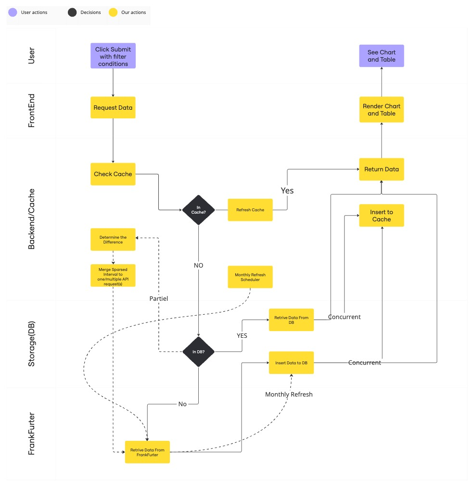

# FX Dashboard Backend

Django-based forex exchange rate API service with Redis caching and PostgreSQL database.

## Data Flow



## Cache/Storage Logic Versions

- v1) No cache, always Fetch data from FrankFurter API
- v2) Use TTLCache to store previously fetched data
- v3) Use PostgreSQL to store previously fetched data
- v4) Add Redis to cache data with high access frequency

## Future Improvement

Update: a runnable v5 is now on branch partial_cache, while it seems slower than our expectation, so further improve and experiment may be necessary

- v5(under developing): Add Partial Cache Logic, compare the data in our DB and the data request by user, only fetch the difference between them from FrankFurter API.

  e.g. If user has previously requested `USD->CAD: 2024-02-01---2024-04-01`, and then request `USD->CAD/EUR: 2024-01-01---2024-05-01`, we should only request
  `USD->CAD: 2024-01-01---2024-01-31`, `USD->CAD: 2024-04-02---2024-05-01` and `USD->EUR: 2024-01-01---2024-05-01`, to make the most use of data in DB and
  reduce API transmission as much as possible.

### Tradeoff:

This partial caching strategy is a trade from `Local Computing + DB Lookup + partial fetch` to `Direct Remote API fetch`,
Further expriment should be done to measure the time/space consumption of each strategy under various data size and network situation,
which helps to determine the break-even point and the optimal strategy based on actual performance metrics.

### Main Factor to be benchmarked:

- Small Data Ranges: `Direct Remote API fetch` may be faster than `DB lookup + partial fetch`
- Big Data Ranges: `DB lookup + partial fetch` may be faster than `Direct Remote API fetch`
- Local Data Sparsity: If the local data is sparse, `DB lookup + partial fetch` may produce overhead because of `multiple small API fetches` is slower than one big `Direct Remote API fetch` (maybe could be solved by multitask, and always fetch whole month)
- Network Latency: Slow network may cause large `Direct Remote API fetch` to be slower than `DB lookup + partial fetch`
- Code Complexity: Unfortunately, Human do make mistake, introducing more complex logic to codebase would indeed increase the possibility of bug and maintaince cost.

## Features

- Time series exchange rate data API
- Currency list API
- Two-layer caching: Redis cache -> PostgreSQL database -> Frankfurter API
- Automatic data persistence to database

## Prerequisites

- Python 3.9+
- Docker and Docker Compose (for PostgreSQL and Redis)
- PostgreSQL 16
- Redis 7

## Setup

### 1. Install Dependencies

```bash
cd FX_Dashboard_back
python3 -m venv .venv
source .venv/bin/activate
pip install -r requirements.txt
```

### 2. Database Setup

#### Start PostgreSQL Container

```bash
docker run -d --name fx_postgres \
  -e POSTGRES_USER=fxuser \
  -e POSTGRES_PASSWORD=fxpass123 \
  -e POSTGRES_DB=fxdb \
  -p 5432:5432 \
  postgres:16-alpine
```

#### Start Redis Container

```bash
docker run -d --name fx_redis \
  -p 6379:6379 \
  redis:7-alpine
```

### 3. Database Configuration

The database configuration uses environment variables with defaults. Edit `fx_dashboard_back/settings.py` or set environment variables:

```bash
export POSTGRES_DB=fxdb
export POSTGRES_USER=fxuser
export POSTGRES_PASSWORD=fxpass123
export POSTGRES_HOST=127.0.0.1
export POSTGRES_PORT=5432
```

Default configuration in `settings.py`:

- Database: PostgreSQL (fxdb)
- User: fxuser
- Password: fxpass123
- Host: 127.0.0.1
- Port: 5432

### 4. Cache Configuration

Redis cache is configured in `settings.py`:

- Location: `redis://127.0.0.1:6379/0`
- Key prefix: `fx`
- Default timeout: 300 seconds

Cache timeouts (in seconds):

- currencies: 86400 (24 hours) - configured in CACHE_TIMEOUT
- time_series: 1800 (30 minutes) - configured in CACHE_TIMEOUT

### 5. Run Database Migrations

```bash
python manage.py makemigrations exchange
python manage.py migrate
```

## Running the Server

```bash
python manage.py runserver 0.0.0.0:8080
```

The API will be available at:

- `http://127.0.0.1:8080/api/` (localhost)
- `http://localhost:8080/api/` (localhost)

## API Endpoints

### Get Currencies

```
GET /api/currencies/
```

Returns list of supported currencies.

### Get Time Series Data

```
GET /api/timeseries/?start_date=YYYY-MM-DD&end_date=YYYY-MM-DD&base=CURRENCY&symbols=CURRENCY1,CURRENCY2
```

Parameters:

- `start_date` (required): Start date in YYYY-MM-DD format
- `end_date` (optional): End date in YYYY-MM-DD format. If omitted, uses latest available date
- `base` (optional): Base currency code (default: EUR)
- `symbols` (optional): Comma-separated list of target currency codes

Example:

```
GET /api/timeseries/?start_date=2024-10-01&end_date=2024-10-10&base=USD&symbols=EUR,GBP
```
